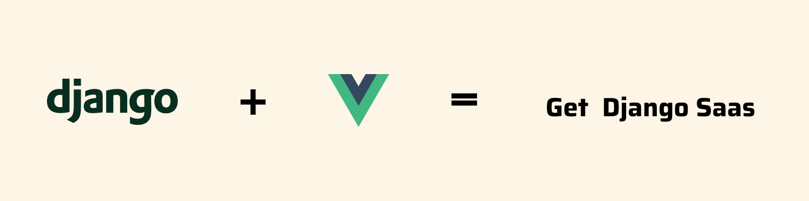

# GetDjangoSaaS - Django Rest Framework/Vue.js SaaS Boilerplate That Saves You Time

**NOTE: GetDjangoSaas is still in early alpha so please send as much as feedback as possible. Thank you!**

## Intro

*GetDjangoSaaS* is DRF/Vue Saas boilerplate to get you started as soon as possible on your next million-dollar idea.

I've built it with simplicity in mind so you'll find the bare minimum of packages inside.

It comes with some pre-built components you may want to use (or not, that's cool too).

There are no code generators inside.

Every package is optional and you can remove and replace each one of them. 

Even the backend and fronend are in seperate directories so if you'd rather use Rails instead of Django or React instead of Vue, you can do that as well.

## Features

- Backend in Django Rest Framework
- Frontend in Vue
- Styling with Tailwind
- Premade components you can use to create an MVP
- Emails with Sendgrid

## Getting Started

1. Clone this repo and cd into it

## Docker route

### Backend Setup

From here you have two routes on how do you want to run the project: Docker route and local setup route

#### Docker route

1. `cd backend` 
2. Create a volume for our database with `docker volume create get-django-saas-postgres`
3. Build and run our Docker composition with `docker-compose up --build`
4. Create a super user with `sudo docker-compose run web python manage.py createsuperuser`

#### Local setup route

1. Install `virtualenv` package with `pip install virtualenv`
2. Create a virtual environment. I keep my venvs in `~/.venvs` folder and create them with `virtualenv ~/.venvs/{PROJECT_NAME}`
3. Enter virtual environment with `source ~/.venvs/{PROJECT_NAME}/bin/activate`
4. `cd backend`
5. Install dependencies with `pip install -r requirements.txt`
6. Run server with `python manage.py runserver`
7. For authentication you'll need to run an email server. This boilerplate uses Sendgrid for emails but I reccoment using Python's built in SMTP server for development. Everything is already set up so all you need to do is open a new terminal an run `python3.6 -m smtpd -n -c DebuggingServer localhost:1025`

### Fronend Setup

1. `cd frontend`
2. `npm install` or `yarn`
3. `yarn serve`

## Screenshots

